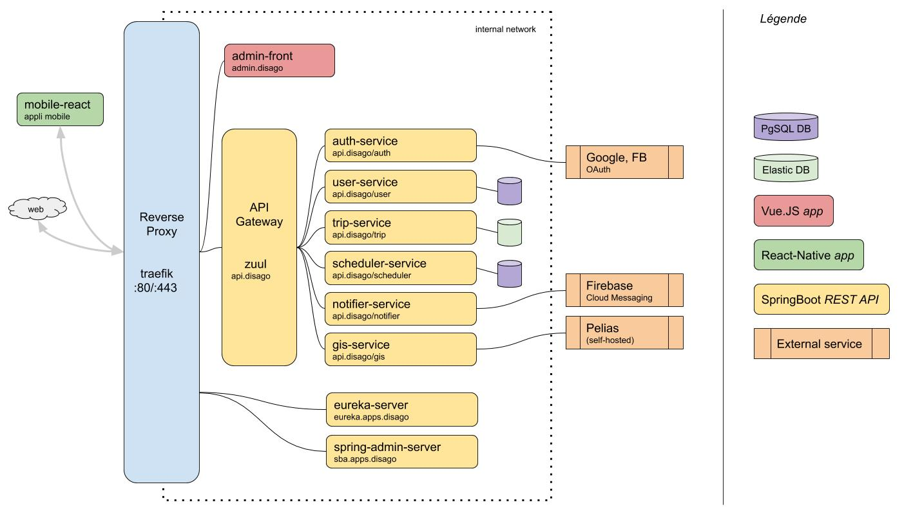

# disago

Application mobile permettant à des personnes à mobilité réduite de se faire aider pour leurs déplacements.

Ce projet a été développé dans le cadre d'un module dispensé à CPE Lyon, en 3 semaines, par une équipe de 5 devs.

## Architecture

Architecture microservices propulsée par **Spring Cloud** (_Eureka_, _Spring Boot Admin_, _Zuul_).
Les services sont développés avec _Spring Boot_ et _dockerizés_.

_Traefik_ est utilisé comme reverse proxy (gestion du SSL, etc.)

## Code

Le code a initialement été poussé sur GitLab, puis ouvert. Voici quelques briques intéressantes :

- https://gitlab.com/disago/admin-front : appli SaaS pour administrer le service
- https://gitlab.com/disago/mobile-react : appli mobile

- https://gitlab.com/disago/auth-service : gestion de l'authentification
- https://gitlab.com/disago/user-service : gestion des utilisateurs

- https://gitlab.com/disago/trip-service : gestion des trajets
- https://gitlab.com/disago/gis-service : gestion des données géographiques
- https://gitlab.com/disago/notifier-service : service gérant les notifications push vers l'appli
- https://gitlab.com/disago/common-java : bibliothèque commune aux services

- https://gitlab.com/disago/gateway-service : API Gateway basée sur Zuul
- https://gitlab.com/disago/eureka-server : Eureka 
- https://gitlab.com/disago/spring-admin-server : interface de monitoring basée sur Spring Admin
